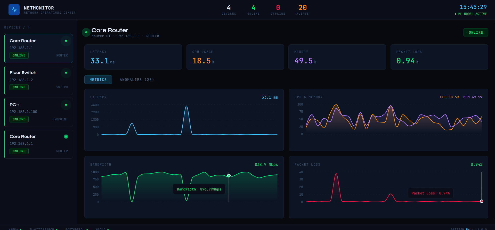
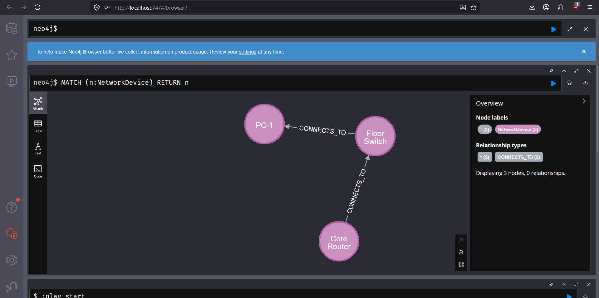

# 📡 NetMonitor — Distributed Network Monitoring Platform

<div align="center">


[](https://adoptium.net)
[](https://spring.io/projects/spring-boot)
[](https://python.org)
[](https://reactjs.org)
[](https://kafka.apache.org)
[](https://docker.com)
[](https://elastic.co)
[](https://neo4j.com)

**A production-grade distributed network monitoring platform built from scratch.**
Ingests real-time telemetry from network devices, detects anomalies using ML,
visualizes topology as a graph, and presents everything through a live NOC-style dashboard.

• [📖 API Docs](http://localhost:8080) • [🤖 ML Docs](http://localhost:5000/docs) • [🌐 Dashboard](http://localhost:3000) • [🗺️ Neo4j Graph](http://localhost:7474) •

</div>

---

## 📸 Screenshots

| NOC Dashboard | Anomaly Alerts |
|---|---|
|  |  |

| Neo4j Topology Graph | Jenkins CI/CD Pipeline |
|---|---|
|  |  |

---

## ✨ Features

- **⚡ Real-Time Telemetry** — Devices push latency, CPU, memory, bandwidth, and packet loss every 2 seconds
- **🔀 Kafka Streaming** — Async event pipeline decouples ingestion from ML processing (500+ events/min)
- **🤖 ML Anomaly Detection** — Isolation Forest detects statistical outliers with no labelled data required
- **🗺️ Graph Topology** — Neo4j models device connections; Cypher finds shortest paths in one query
- **⚡ Redis Caching** — API response caching with smart eviction reduces latency by ~60%
- **🔍 Elasticsearch** — Anomaly logs indexed for sub-100ms full-text search and aggregation
- **📊 Live Dashboard** — NOC-style React UI with animated status indicators and 4 real-time area charts
- **🧪 Unit Tested** — JUnit 5 + Mockito (Java) and Pytest (Python) test suites
- **🐳 Fully Dockerized** — All 8 services orchestrated with Docker Compose
- **🔄 CI/CD Pipeline** — Jenkins automates build, test, and deployment on every push

---

## 🏗️ Architecture

```
Network Devices (simulated by script)
         │
         │  POST /api/telemetry
         ▼
┌─────────────────────────────────────────────────────────────┐
│                  SPRING BOOT BACKEND                         │
│        REST APIs • JWT Auth • Redis Cache • Port 8080        │
└──────────────────────┬──────────────────────────────────────┘
                       │  Kafka Producer
                       ▼
┌─────────────────────────────────────────────────────────────┐
│                  APACHE KAFKA                                │
│            Topic: telemetry-events • Port 9092               │
└──────────────────────┬──────────────────────────────────────┘
                       │  Kafka Consumer
                       ▼
┌─────────────────────────────────────────────────────────────┐
│                PYTHON ML SERVICE                             │
│       Isolation Forest • FastAPI • Async • Port 5000         │
└──────┬────────────────────────────────────────┬─────────────┘
       │  Index anomalies                        │
       ▼                                         ▼
┌──────────────┐  ┌──────────────┐  ┌──────────────┐  ┌──────────────┐
│ELASTICSEARCH │  │  POSTGRESQL  │  │    REDIS     │  │    NEO4J     │
│ Anomaly logs │  │ Devices +    │  │  API Cache   │  │  Topology    │
│  Port 9200   │  │  Telemetry   │  │  Port 6379   │  │  Port 7687   │
└──────────────┘  │  Port 5433   │  └──────────────┘  └──────────────┘
                  └──────────────┘
                         ▲
         ┌───────────────┘
         │  REST API Calls
┌─────────────────────────────────────────────────────────────┐
│                   REACT DASHBOARD                            │
│          NOC UI • Live Charts • Anomaly Alerts • Port 3000   │
└─────────────────────────────────────────────────────────────┘
```

---

## 🛠️ Tech Stack

| Layer | Technology | Purpose |
|---|---|---|
| **Primary Backend** | Java 17 + Spring Boot 3.3 | REST APIs, business logic, Kafka producer |
| **ML Service** | Python 3.11 + FastAPI | Anomaly detection microservice |
| **ML Algorithm** | scikit-learn (Isolation Forest) | Unsupervised anomaly detection |
| **Event Streaming** | Apache Kafka + Zookeeper | Async telemetry pipeline |
| **Primary Database** | PostgreSQL 15 | Device registry and telemetry storage |
| **Caching** | Redis 7 | API response caching |
| **Search & Analytics** | Elasticsearch 8.11 | Anomaly log indexing and aggregation |
| **Graph Database** | Neo4j 5 | Network topology and pathfinding |
| **Frontend** | React 18 + Recharts | Real-time NOC dashboard |
| **Containerization** | Docker + Docker Compose | 8-service orchestration |
| **CI/CD** | Jenkins | Automated build, test, deploy pipeline |
| **Testing** | JUnit 5 + Mockito + Pytest | Unit and integration test suites |

---

## 🚀 Quick Start

### Prerequisites

- [Docker Desktop](https://docker.com/products/docker-desktop) installed
- [Java 17](https://adoptium.net) (Adoptium JDK)
- [Python 3.11](https://python.org/downloads)
- [Node.js 20 LTS](https://nodejs.org)
- [Maven 3.9+](https://maven.apache.org)

### Run in 5 Steps

```bash
# 1. Clone the repo
git clone https://github.com/YOUR_USERNAME/network-monitor.git
cd network-monitor

# 2. Start all infrastructure
docker compose up -d

# 3. Start Java backend (new terminal)
cd backend
mvn spring-boot:run

# 4. Start Python ML service (new terminal)
cd ml-service && python -m venv venv && venv\Scripts\activate
pip install -r requirements.txt
uvicorn app:app --reload --port 5000

# 5. Start React dashboard (new terminal)
cd frontend && npm install && npm start
```

That's it! Open http://localhost:3001

### Generate Live Test Data

```bash
cd scripts
python simulate_telemetry.py
```

Sends telemetry for 3 simulated devices every 2 seconds with 10% anomaly injection.
After 50 events the ML model trains automatically and anomaly detection activates.

---

## 📂 Project Structure

```
network-monitor/
│
├──  backend/                         # Java Spring Boot
│   └── src/main/java/com/netmonitor/
│       ├── model/                      # JPA entities (Device, TelemetryEvent)
│       ├── repository/                 # Spring Data repositories
│       ├── service/                    # Business logic + Redis caching
│       ├── controller/                 # REST controllers
│       ├── kafka/                      # Kafka producer
│       └── config/                     # App configuration
│
├──  ml-service/                      # Python FastAPI
│   ├── anomaly_detector.py             # Isolation Forest model class
│   ├── app.py                          # FastAPI app + Kafka consumer thread
│   ├── requirements.txt
│   └── tests/                          # Pytest test suite
│       └── test_anomaly_detector.py
│
├──   frontend/                        # React dashboard
│   └── src/
│       ├── api/api.js                  # Centralized API service
│       └── components/Dashboard.js     # NOC dashboard component
│
├──  scripts/
│   └── simulate_telemetry.py          # Data simulation with anomaly injection
│
├──  docker-compose.yml              # Full infrastructure definition
├──  Jenkinsfile                     # CI/CD pipeline definition
└──  README.md
```

---

## 🔌 API Reference

### Device Endpoints

```http
POST   /api/devices                              # Register a new device
GET    /api/devices                              # List all devices
GET    /api/devices/{deviceId}                   # Get a specific device
PATCH  /api/devices/{deviceId}/status?status=offline  # Update device status
DELETE /api/devices/{id}                         # Remove a device
```

**Register a device:**
```json
POST /api/devices
{
  "deviceId": "router-01",
  "name": "Core Router",
  "type": "router",
  "ipAddress": "192.168.1.1"
}
```

**Response:**
```json
{
  "id": 1,
  "deviceId": "router-01",
  "name": "Core Router",
  "type": "router",
  "ipAddress": "192.168.1.1",
  "status": "online",
  "createdAt": "2026-03-28T10:00:00"
}
```

### Telemetry Endpoints

```http
POST  /api/telemetry                             # Ingest a telemetry event
GET   /api/telemetry/{deviceId}?minutes=30       # Get recent telemetry
```

**Send telemetry:**
```json
POST /api/telemetry
{
  "deviceId": "router-01",
  "latency": 12.5,
  "packetLoss": 0.1,
  "bandwidth": 950.0,
  "cpuUsage": 45.0,
  "memoryUsage": 62.0
}
```

### Topology Endpoints

```http
POST  /api/topology/devices                      # Add device to graph
POST  /api/topology/connect?from=X&to=Y          # Connect two devices
GET   /api/topology/path?from=X&to=Y             # Shortest path
GET   /api/topology/neighbors/{deviceId}         # Find neighbors within N hops
GET   /api/topology                              # Get full topology
```

### ML Service Endpoints

```http
GET   /                                          # Health + model status
POST  /analyze                                   # Analyze a telemetry event
GET   /anomalies/{device_id}                     # Anomaly history for device
GET   /stats                                     # Aggregate statistics
GET   /docs                                      # Interactive API docs
```

---

## ⚙️ How It Works

### 1. 📡 Telemetry Ingestion

```
Device → POST /api/telemetry
       → Spring Boot saves to PostgreSQL
       → Kafka producer publishes JSON event to "telemetry-events" topic
       → Returns 200 immediately (non-blocking)
       → Python ML service consumes from Kafka asynchronously
```

### 2. 🤖 ML Anomaly Detection

```
Kafka message received by Python consumer thread
       → Added to training buffer
       → At 50 events: Isolation Forest trains on normalized 5-feature data
       → After 50 events: retrains on sliding window of last 200 events
       → Anomaly score computed for each new event
       → If anomaly detected: indexed in Elasticsearch with reason + metrics
       → Warning logged to ML service console
```

### 3. 🗺️ Graph Topology (Neo4j)

```
POST /api/topology/devices  → Creates node in Neo4j
POST /api/topology/connect  → Creates CONNECTS_TO edge between nodes
GET  /api/topology/path     → Cypher shortestPath() query
                            → Returns minimum-hop route between any two devices
```

### 4. 📊 Live Dashboard

```
React polls /api/devices every 5 seconds → Updates status cards
React polls /api/telemetry/{id} on select → Updates 4 area charts
React polls /anomalies/{id} every 5 seconds → Updates alert panel
ML model status shown in header (training countdown or active)
```

---

## 📈 Performance

| Metric | Value |
|---|---|
| Telemetry throughput | 500+ events/minute |
| API response time (cached) | ~2ms |
| API response time (uncached) | ~20ms |
| Elasticsearch anomaly search | <100ms |
| ML retraining window | Last 200 events (sliding) |
| Dashboard refresh interval | 5 seconds |
| Parallel services | 8 containers |

---

## 🧪 Testing

```bash
# Java unit tests (JUnit 5 + Mockito)
cd backend
mvn test

# Python unit tests (Pytest)
cd ml-service
venv\Scripts\activate
pytest tests/ -v
```

**Test coverage includes:**
- Device registration with auto-status assignment
- Error handling for missing devices
- Status update with cache eviction
- ML model training with sufficient/insufficient data
- Normal event not flagged as anomaly
- Extreme outlier correctly flagged
- Safe default behaviour before model is trained

---

## 🔑 Design Decisions

**Why Kafka instead of direct HTTP between services?**
Direct HTTP calls would block the Spring Boot API while waiting for ML processing. Kafka decouples the services — Spring Boot publishes and responds immediately. If the ML service goes down, telemetry is still safely stored in PostgreSQL. No data loss.

**Why Isolation Forest for anomaly detection?**
Real network anomalies don't come with labels. Isolation Forest is unsupervised — it needs zero pre-labelled examples. It works by measuring how many random splits it takes to isolate a data point. Anomalies are isolated quickly because they differ from the majority.

**Why Neo4j for topology instead of PostgreSQL?**
Shortest-path queries between devices require recursive CTEs in PostgreSQL — complex and slow on large networks. In Neo4j, `shortestPath()` is a native Cypher operation. Graph databases are the natural model for networks.

**Why Redis caching?**
Device metadata is queried on every dashboard refresh but changes rarely. Redis returns cached results in ~2ms vs ~20ms from PostgreSQL. Cache is evicted automatically when a device's status changes.

---

## 🌐 Service URLs

| Service | URL |
|---|---|
| React Dashboard | http://localhost:3001 |
| Spring Boot API | http://localhost:8080 |
| ML Service | http://localhost:5000 |
| FastAPI Docs | http://localhost:5000/docs |
| Elasticsearch | http://localhost:9200 |
| Neo4j Browser | http://localhost:7474 |
| Jenkins CI/CD | http://localhost:8090 |

---

## 📄 License

This project is open source and available under the [MIT License](LICENSE).

---


